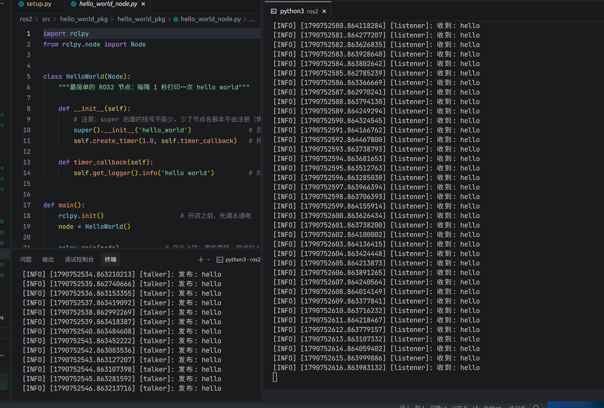
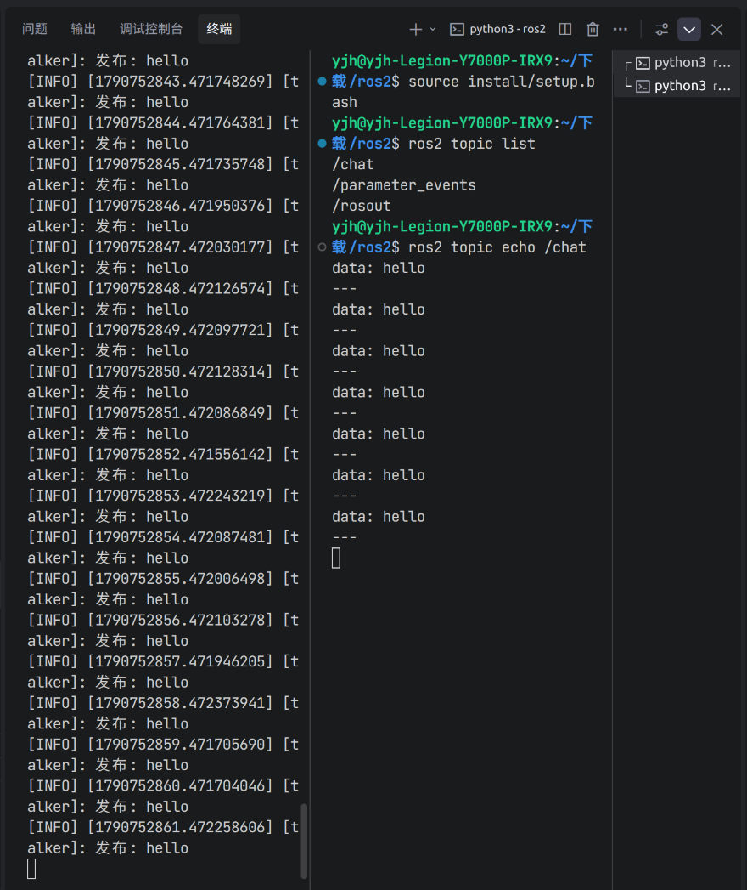
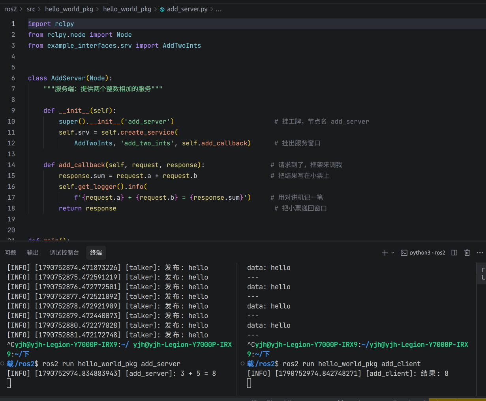
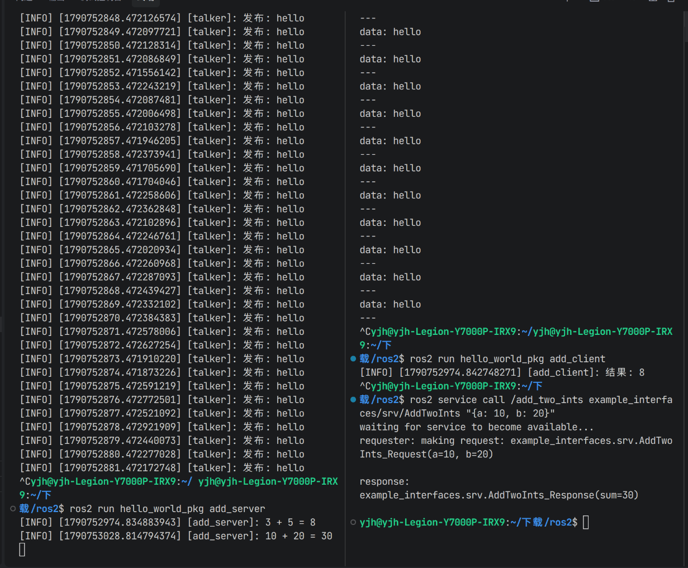
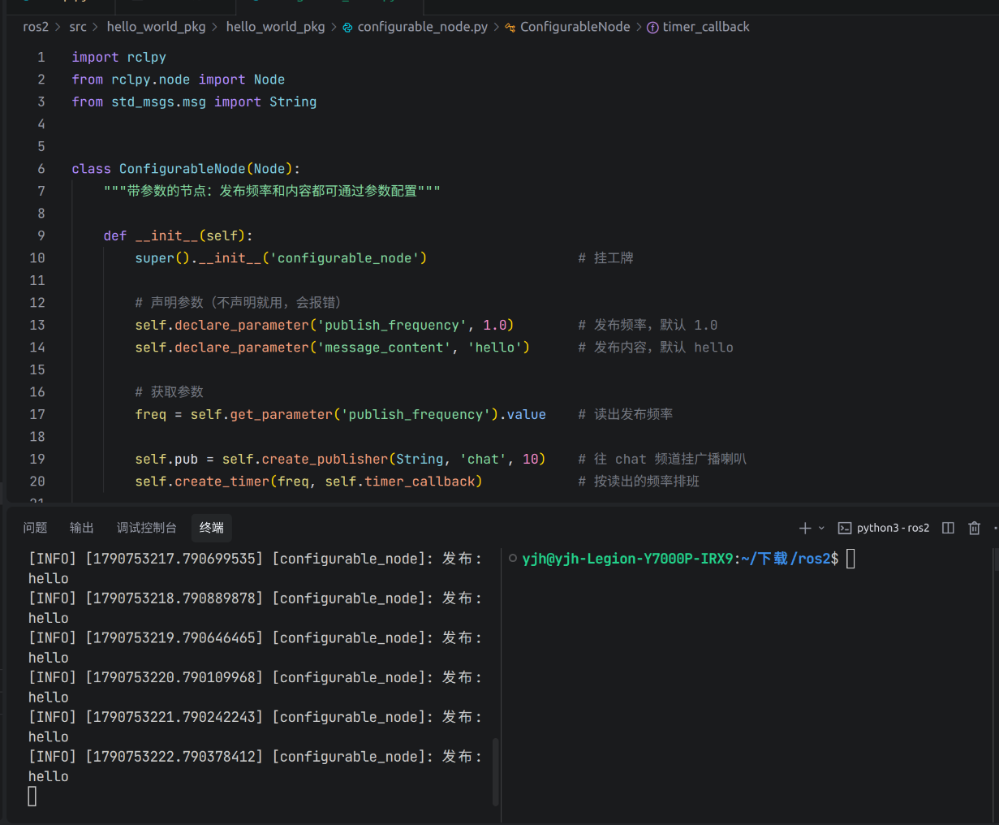
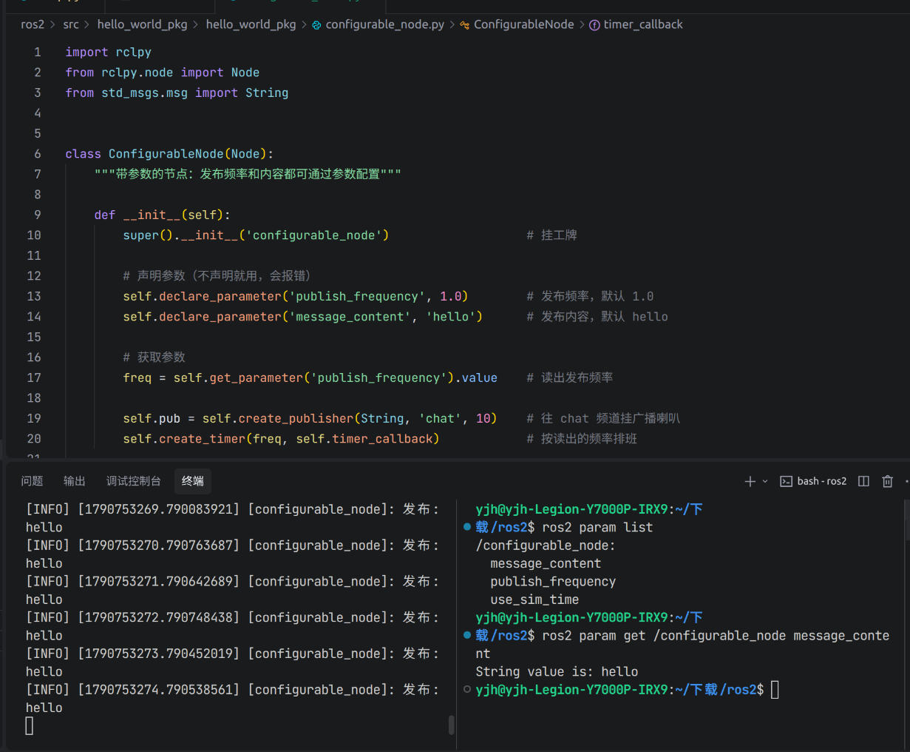
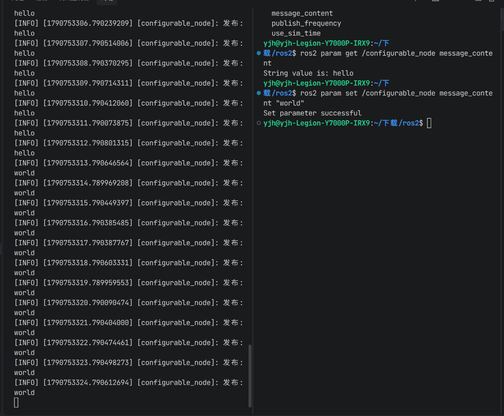
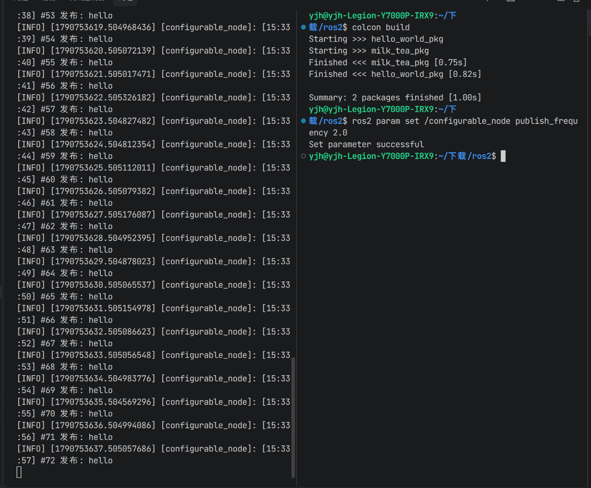
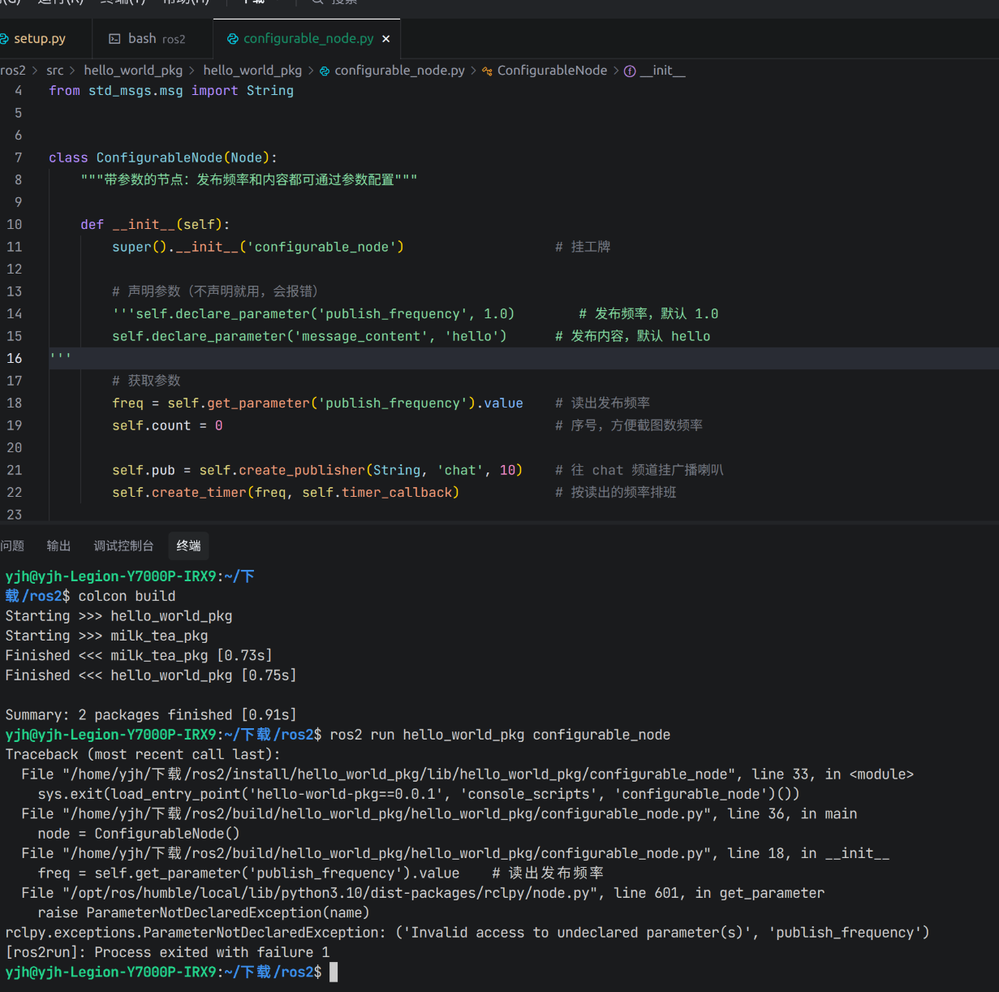

## 导言

上一篇博客我写了 ROS2 代码为什么看起来不一样。核心观点是：普通 Python 是"我调用别人"，ROS2 是"别人调用我"——这叫**控制反转**。

那篇写的是**一个节点内部**的事——你的代码怎么被框架调用。这篇写另一个初学者绕不开的问题：**既然节点是独立进程，它们之间怎么说话？**

在普通 Python 里，这太简单了——`import` 另一个模块，调用它的函数，拿返回值，完事。但在 ROS2 里，你不能这样做。

因为节点之间不能直接调函数，只能**发消息**。这就是这篇文章的核心观点——**消息传递**：不是你调用另一个节点的函数，是你把数据打包成消息发出去，框架负责传递，对方收到后自己处理。

这篇还是用奶茶店把这件事讲清楚。每个比喻后面我都会跟一句技术翻译，确保你既记住了奶茶，也记住了 ROS2。

> 环境：Ubuntu 22.04 + ROS2 Humble + Python 3.10
> 完整代码：[本仓库 ros2-hello-world/ 目录](https://github.com/wbxxmz/my-boke/tree/main/ros2-hello-world)

## 30 秒版

赶时间的话，记住一张表和一句话就够了：

| 维度 | 话题 | 服务 | 参数 |
|---|---|---|---|
| 模型 | 发布/订阅 | 请求/响应 | 键值对 |
| 要回复吗 | 不要，发完就走 | 要，一问一答 | — |
| 怎么等回复 | 不用等 | 推荐 `call_async`（异步）；同步 `call` 易死锁不推荐 | — |
| 方向 | 多对多 | 一个服务端，可服务多个客户端 | 节点自身 |
| 适合场景 | 持续数据流 | 一次性任务 | 运行时配置 |
| 奶茶店翻译 | 广播 | 点单 | 调配方 |
| 典型例子 | 相机图像 | 查询地图 | 发布频率 |

一句话：**话题管持续数据流，服务管一次性请求响应，参数管节点自身配置。**

下面展开讲为什么。

## 先看普通 Python 怎么通信

```python
# module_a.py
def get_sensor_data():                      # 定义一个函数，返回传感器数据
    return 42

# module_b.py
from module_a import get_sensor_data        # 把 module_a 的函数 import 进来

data = get_sensor_data()                     # 直接调用，拿到返回值
print(data)                                  # 打印
```

`module_b` 直接调用 `module_a` 的函数，拿到返回值，继续干活。

**特点**：

- **同步**：调用后站在原地等返回
- **紧耦合**：`module_b` 必须知道 `module_a` 的函数名，还得能 import 到
- **进程内**：同一个 Python 进程里，共享同一块内存
- **直接**：函数调用，拿返回值，一步到位

记住这四条——等会儿在 ROS2 里它们会被逐条推翻，对比着看，差异就全出来了。

**奶茶店翻译**：这像后厨和点单员是同一个人。点单员直接问后厨"珍珠煮好了吗"，后厨回答"好了"。一句话的事，不需要对讲机。

**但 ROS2 里，点单员和后厨是两个人，不在同一个房间，甚至不在同一家店。**

## 为什么 ROS2 不能直接调用函数

ROS2 的节点是**独立进程**。"独立进程"这四个字听起来平平无奇，但它带来的后果是初学者最容易低估的：

- 它们可能跑在**同一台机器**上，也可能跑在**不同机器**上（一个在工控机，一个在云端）
- 可能用 **Python** 写，也可能用 **C++** 写——你总不能让 Python 直接 import 一个 C++ 的函数吧（跨语言绑定技术上是有的，但那是把代码编进同一个进程，跟"两个独立进程"是两码事）
- 可能**同时运行**，也可能**先后启动**——A 节点启动时 B 节点还没起来
- **一个节点崩了，不影响其他节点**——这是隔离带来的好处，但也意味着它们互相看不见对方的函数和变量（各有各的内存空间）

**技术翻译**：进程隔离意味着两个节点各有各的内存空间，互相看不见对方的函数和变量，自然也没有直接函数调用。你需要一种**跨进程通信机制**——不直接调函数，而是把数据打包成消息发出去，对方收到后自己拆开处理。

这就是**消息传递**——和上一篇的"控制反转"是同一套思维的两面：节点内部，框架调你（控制反转）；节点之间，你发消息、框架传（消息传递）。

对讲机就是 ROS2 的通信机制。但"通信"不止一种方式，ROS2 提供了三种：**话题**（广播）、**服务**（点单）、**参数**（调配方）。下面我们一种一种来。

## 话题：广播

### 奶茶店版本

话题就像店里的**广播喇叭**。点单员对着对讲机喊"3 号桌要一杯珍珠奶茶"，所有在后厨的人都听到了。谁关心谁处理，不关心的继续干自己的活。

点单员不关心谁听到了，也不等回复。喊完就继续接下一单。

### 技术翻译

- 发布者/订阅者模型
- **异步**：发布者不等订阅者
- **多对多**：一个话题可以有多个发布者和多个订阅者
- 适合场景：传感器数据流、持续的状态广播

### 代码示例

```python
import rclpy
from rclpy.node import Node
from std_msgs.msg import String

# 发布者
class Talker(Node):
    def __init__(self):
        super().__init__('talker')                       # 挂工牌，节点名 talker
        self.pub = self.create_publisher(String, 'chat', 10)  # 往 chat 频道挂广播喇叭
        self.create_timer(1.0, self.timer_callback)      # 排班：每秒喊一次

    def timer_callback(self):
        msg = String()                                    # 拿一张空白纸条（String 类型的消息对象）
        msg.data = 'hello'                                # 在纸条上写内容，data 是 String 消息唯一的字段
        self.pub.publish(msg)                            # 喊出去，不等任何人
        self.get_logger().info(f'发布: {msg.data}')      # 用对讲机记一笔"我喊了 hello"

# 订阅者
class Listener(Node):
    def __init__(self):
        super().__init__('listener')                     # 挂工牌，节点名 listener
        self.sub = self.create_subscription(
            String, 'chat', self.callback, 10)           # 声明：我听 chat 频道

    def callback(self, msg):                              # 数据到了，框架来调我
        self.get_logger().info(f'收到: {msg.data}')      # 从纸条上读内容，用对讲机记一笔
```

### 逐行拆解（重点看和普通 Python 的差异）

代码注释已经把每行的奶茶店含义讲了，这里只挑几个**普通 Python 里没有、容易误解**的点展开：

- `create_publisher(String, 'chat', 10)`：你没有拿到任何"订阅者"的引用——不知道、也不需要知道谁在听。普通 Python 调函数必须知道对方是谁，这里双方只需要约定频道名 `chat`。参数里的 `10` 是**队列深度**：订阅者一时来不及处理时，最多替它缓存最近 10 条消息，再新的来了就把最旧的挤掉（这属于 QoS 设置，本文不展开，先知道它是个缓存条数就行）。
- `callback(self, msg)`：这是话题最核心的一点——**数据到了，是框架来调你，不是你伸手去拿。** 普通 Python 是 `data = get_data()` 主动取；这里你从"主动要数据的人"变成了"被通知的人"。

| | 普通 Python | ROS2 话题 |
|---|---|---|
| 数据怎么来 | `data = get_data()` 主动调 | 数据到了，框架调你的 callback |
| 要认识对方吗 | 必须 import 且知道函数名 | 双方只知道频道名 `chat` |
| 对方没启动 | `ImportError`，直接崩 | 发布者照发，订阅者上线后收后续消息 |
| 等不等结果 | 等返回值 | 发完就走 |

> 为了聚焦通信本身，本文示例都省略了 `main` 函数（`rclpy.init`、`spin` 和资源清理）。完整可运行代码放在 GitHub 仓库里，结构和上一篇的 hello_world 一样。

### 跑起来看看

开两个终端，左边跑发布者，右边跑订阅者——两个独立进程，通过 `chat` 频道完成了对话：



不用写代码，命令行工具也能"旁听"——`ros2 topic list` 列出当前所有频道，`ros2 topic echo /chat` 直接读广播内容：



### 为什么话题是异步的

因为机器人身上，传感器数据是**持续不断**地产生的——雷达每秒 10 次、摄像头每秒 30 帧。如果发布者每发一条都要等订阅者处理完，那传感器就被卡住了，下一帧数据没人收。

所以话题的设计是：**我只负责把数据扔出去，谁爱收谁收，收不收得到、什么时候收，跟我没关系。**

这就是**消息传递**的第一种形式：我把数据扔出去，谁爱收谁收，不指望回复。**什么时候用**：数据是持续流、发布者不关心谁收到、多个订阅者共享同一数据；需要等回复才能继续的事，别用它。

## 服务：点单

### 奶茶店版本

服务就像**顾客点单**。顾客问"你们有没有珍珠？"店员回答"有"或"没有"。顾客等回答，拿到回答才继续。

这是一问一答，有明确的请求和响应。

### 技术翻译

- 客户端/服务端模型
- **请求-响应**：有问必答，一问一答；一个服务名只能有一个服务端，但可以有多个客户端
- **调用方式推荐异步**（`call_async`）：同步 `call` 容易死锁，官方明确不推荐——"等答案"是业务上要等，不是把节点冻住干等
- 适合场景：一次性查询、配置修改、触发某个动作

### 代码示例

```python
from example_interfaces.srv import AddTwoInts

# 服务端
class AddServer(Node):
    def __init__(self):
        super().__init__('add_server')                       # 挂工牌，节点名 add_server
        self.srv = self.create_service(
            AddTwoInts, 'add_two_ints', self.add_callback)  # 挂出服务窗口，窗口名 add_two_ints

    def add_callback(self, request, response):             # 请求到了，框架来调我
        response.sum = request.a + request.b               # 把结果写在小票的 sum 字段上
        self.get_logger().info(f'{request.a} + {request.b} = {response.sum}')  # 用对讲机记一笔
        return response                                     # 把小票递回窗口

# 客户端
class AddClient(Node):
    def __init__(self):
        super().__init__('add_client')                       # 挂工牌，节点名 add_client
        self.client = self.create_client(
            AddTwoInts, 'add_two_ints')                     # 找到 add_two_ints 窗口，拿号排队
        while not self.client.wait_for_service(timeout_sec=1.0):  # 窗口没开张，每隔1秒问一次
            self.get_logger().info('等待服务端...')          # 用对讲机念叨一句"还没开门"
        self.send_request()                                  # 窗口开了，进去办业务

    def send_request(self):
        request = AddTwoInts.Request()                       # 拿一张空白点单条
        request.a = 3                                        # 在点单条上填 a=3
        request.b = 5                                        # 在点单条上填 b=5
        self.future = self.client.call_async(request)       # 把点单条递进去，不原地等
        self.future.add_done_callback(self.response_callback)  # 小票出好了再叫我

    def response_callback(self, future):                     # 小票出好了，框架来叫我
        response = future.result()                            # 从小票里取出结果
        self.get_logger().info(f'结果: {response.sum}')      # 看一眼找零，用对讲机记一笔
```

### 逐行拆解（重点看和普通 Python 的差异）

**服务端**：

- `add_callback(self, request, response)` 和普通函数的两个本质区别：
  - **参数不是你定的**：`request`、`response` 是接口定义好的结构体，字段名（`a`、`b`、`sum`）来自 `AddTwoInts.srv`，相当于点单条和小票的格式是预先约定好的，你只能填不能改。
  - **结果不能直接 `return` 裸值**：要写进 `response` 再 `return response`。因为框架需要拿到完整的响应对象去序列化、回传给客户端。

**客户端**：

- `wait_for_service`：普通 Python `import` 完函数就一定存在；ROS2 服务端是独立进程，可能还没启动，所以必须先等。这是分布式系统的常态——你不能假设对方在线。
- `call_async` + `future`：`call_async` 发出请求后**立即返回**，不阻塞等待。返回的 `future` 是一个"未来会有结果"的占位对象，配合 `add_done_callback` 实现"结果到了再通知我"。

### 跑起来看看

左边服务端，右边客户端。客户端把 `a=3, b=5` 填进点单条递进去，服务端算完把 `sum=8` 写上小票递回来：



懒得写客户端时，命令行也能直接点单——`ros2 service call` 把 `a=10, b=20` 递进同一个窗口，拿到 `sum=30`：



### 为什么不能像普通函数那样同步等

你可能会想：我就想同步等，不行吗？

行，但强烈不推荐——官方文档对同步调用（`call`）的警告写得很直白：**极易死锁，而且死锁时没有任何提示**——不报错、不抛异常、调用也不失败，节点就静悄悄地卡死。最典型的死法：在回调里调 `call`，而响应只能由同一个线程送回来，那就永远等不到了。就算你把 `spin` 挪到单独的线程里小心翼翼地绕开死锁，等待期间你的节点也**什么都干不了**——订阅消息收不到、定时器不触发、其他服务请求不响应。而机器人系统里，一个节点往往同时干好几件事，不能因为等一个回复就把整个节点冻住。

所以官方推荐 `call_async`——发出去就继续干别的，回复到了再通过回调通知你。上面代码示例里用的正是它。

奶茶店翻译：店里只有一个店员，他站在窗口等后厨回话，外面排队的顾客就没人接待了。所以实际做法是：点单员把单子递进去，先去接待下一位顾客，后厨做好了再叫他。

这就是**消息传递**的第二种形式：我发一个请求消息，等对方回一个响应消息，一问一答。**什么时候用**：需要一问一答、任务一次性、必须拿到结果才能继续（查询地图、触发校准）；持续流别用它，耗时很长的任务留给 Action（下一篇写）。

## 参数：调配方

### 奶茶店版本

参数就像店里的**配方表**。珍珠煮多久、糖放多少、冰加几块，这些不是"通信"，是配置。店长可以随时调整配方，所有员工按新配方执行。顾客不关心配方，只关心奶茶好不好喝。

### 技术翻译

- 键值对，属于节点自身
- 语义上是节点的运行时配置，不是节点间的数据流——但实现上其实也是走服务（`ros2 param set` 底层就是在调用你节点上的参数服务，框架帮你包好了而已）
- 可以在启动时设置，也可以运行时动态修改
- 适合场景：阈值、频率、路径、模式开关

### 代码示例

```python
class ConfigurableNode(Node):
    def __init__(self):
        super().__init__('configurable_node')                # 挂工牌，节点名 configurable_node

        # 声明参数（不声明就用，会报错）
        self.declare_parameter('publish_frequency', 1.0)     # 登记：我有个配置项叫 publish_frequency，默认 1.0
        self.declare_parameter('message_content', 'hello')   # 登记：我有个配置项叫 message_content，默认 hello

        # 获取参数
        freq = self.get_parameter('publish_frequency').value  # 读出发布频率的默认值

        self.pub = self.create_publisher(String, 'chat', 10)  # 往 chat 频道挂广播喇叭（同话题那节）
        self.create_timer(freq, self.timer_callback)          # 按读出的频率排班

    def timer_callback(self):
        msg = String()                                        # 拿一张空白纸条
        msg.data = self.get_parameter('message_content').value  # 每次发布前读最新值
        self.pub.publish(msg)                                 # 喊出去
```

### 逐行拆解（重点看和普通 Python 的差异）

- `declare_parameter('publish_frequency', 1.0)`：参数必须**先声明后使用**，不声明直接 `get` 或 `set` 会报 `Parameter not declared`。普通 Python 里 `self.freq = 1.0` 赋值即用，没有这一步。声明的意义是把参数登记到节点名下，让外部（CLI、launch 文件、其他节点）能发现和修改它。
- `get_parameter(...).value`：多出来的 `.value` 不是多余的——参数系统内部存的是 `ParameterValue` 类型（带类型标签的包装），`.value` 才取出原始的 Python 值（int/float/string/bool）。
- `msg.data = self.get_parameter('message_content').value`：**用的时候现读**是关键，下面踩坑环节细说。

`create_publisher`、`create_timer`、`publish` 和话题那节完全一致，不再重复。

### 跑起来看看

节点按声明时的默认值运行——每 1 秒发布一条 hello：



用命令行看这个节点登记了哪些配方——`ros2 param list` 列出全部参数，`ros2 param get` 读出 `message_content` 当前值是 hello：



运行时修改：

```bash
ros2 param set /configurable_node publish_frequency 2.0
ros2 param set /configurable_node message_content "world"
```

两条命令的效果完全不同。改 `message_content` 立竿见影——set 完下一条消息就从 hello 变成了 world（因为代码每次发布前都重读它）：



改 `publish_frequency` 就诡异了——CLI 明明返回成功，发布频率却纹丝不动，还是每秒一条：



> **重要：我自己踩过的坑**：`ros2 param set` 只是更新了节点里参数存的值，代码要"用的时候去读"，新值才会生效。上面 `timer_callback` 每次发布前都重新读 `message_content`，所以 set 完下一条消息就变了；而 `publish_frequency` 不行——timer 的频率在 `create_timer` 那一刻就定死了，set 之后没有任何代码去重建 timer，改了也不会变（CLI 还会返回成功，更具迷惑性）。
>
> 我当时改了频率发现没变，还以为是命令没执行成功，反复 set 了好几遍。后来才明白：**set 了 ≠ 生效，读了才生效**。想让参数一变就自动触发逻辑（比如运行时改频率），需要注册参数回调，属于进阶内容。现在先记住这句就够了。

这就是第三种形式：不是节点间的数据流，是节点自己的配置。**什么时候用**：节点行为需要可配置（阈值、频率、路径），不想改代码就能调整；节点之间传数据、广播、请求响应都不归它管。

## 为什么需要三种，不能只用一种

你可能会想：既然都是"发消息"，为什么不统一成一种？比如全用服务，或者全用话题？

因为机器人系统里**同时存在三种完全不同的需求**。用一个具体场景串起来看——假设你在做一台自主导航机器人：

**场景一：激光雷达持续扫描周围障碍物**

雷达每秒转 10 圈，每圈产生一帧点云数据，要送给导航、避障、建图三个模块同时使用。

用**服务**：三个客户端轮询同一个服务端，频率高了服务端扛不住，频率低了数据有延迟；而且服务是"一问一答"，拿完这帧，下一帧还得再问，天生不适合持续流。用**参数**更不对——雷达数据不是配置。

所以只能用**话题**：雷达往 `/scan` 频道广播，谁需要谁订阅，一帧数据多个模块同时收到。

**场景二：导航模块查询"某个坐标能不能走"**

到了岔路口，要问地图服务"（3, 5）这个点是障碍物还是可通行区域"。这个问题有明确的答案，而且必须拿到答案才能决定往哪走。

用**话题**：你得发一个"查询请求"话题，等一个"查询结果"话题——请求和响应怎么配对？地图模块没收到请求怎么办？等多久算超时？多个模块同时问，响应怎么区分？这些本来是服务该干的活，用话题就得自己造轮子。

所以只能用**服务**：一问一答，框架帮你处理配对和超时。

**场景三：调试时想把避障距离从 0.5 米改成 0.3 米**

这个值是避障节点自己的配置，改完它下次判断障碍时用新值就行，不需要通知别的节点。

用**话题**：发一条"配置变更"消息，避障节点订阅后自己改——这本来就是它自己的事，为什么要走通信？而且节点没启动的话消息就丢了。用**服务**：得专门写一个"设置配置"的服务——杀鸡用牛刀，而且改完就没了，下次启动还得再改。

所以只能用**参数**：直接 `ros2 param set`，值存在节点里，启动时也能通过 launch 文件加载。

**一句话总结**：三种机制不是设计冗余，是各管一摊。选错了不是不能用，是别扭、低效、容易出 bug。

## 常见错误：我踩过的坑

**错误一：用话题做请求/响应**

发布一个"请求"话题，等一个"响应"话题——本质是在用话题模拟服务，超时、配对、多客户端全得自己写。需要一问一答，直接用服务。

**错误二：用服务传持续数据**

服务是一次性的，不适合高频数据流。传感器数据用话题，别用服务轮询——频率高了卡，低了延迟大，两头不讨好。

**错误三：把参数当通信手段**

参数是节点自己的配置。想"通知"另一个节点某个值变了，应该用话题——参数是"我自己的配方"，不是"我跟别人说的话"。

**错误四：忘了参数要先声明**

不声明直接 `get`，会报 `Parameter not declared`。我一开始还以为是参数没设置，后来才发现是连声明都没声明。翻车现场——把 `declare_parameter` 注释掉直接 `get`，当场抛 `ParameterNotDeclaredException`：



## 回到核心观点

第一篇讲的是**控制反转**：不是你调用框架，是框架调用你。

这一篇讲的是**消息传递**：不是你调用另一个节点的函数，是你发消息，框架负责传递。

两者合起来，就是 ROS2 的编程模型：

> **你声明要做什么，框架负责什么时候做、怎么传。**

**奶茶店翻译**：你不是自己冲奶茶，也不是直接指挥后厨。你开了家店，定了规矩，店长负责调度，对讲机负责传话。你只管把配方写好、把窗口挂好，剩下的交给系统。

## 对学习者的启示

我踩过的弯路是：想把普通 Python 的通信习惯硬套进 ROS2，越套越别扭。后来我给自己定了一套"先问"清单：

- 看到"持续""流""广播"，想**话题**
- 看到"查询""触发""一次性"，想**服务**
- 看到"配置""阈值""频率"，想**参数**
- 不确定的时候，先问：这个数据是持续流的，一问一答的，还是配置？
- 改完参数，先问：代码里有没有在运行时重新读这个参数？

理解这一点，比记住任何 API 都重要。

## 结尾

话题、服务、参数不是三个孤立的知识点，是三种解决不同问题的工具。选对了，系统简洁可靠；选错了，怎么调都别扭。

奶茶店类比帮不到的地方（QoS 协商、服务超时、参数回调——"改了发布频率却不变"的完整解法就是参数回调）和还没讲的 Action，留给后面的文章。

如果文中有理解错误的地方，欢迎指出。
