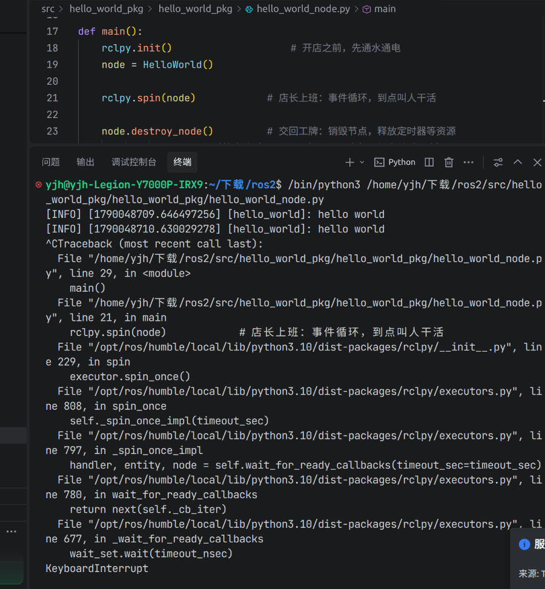
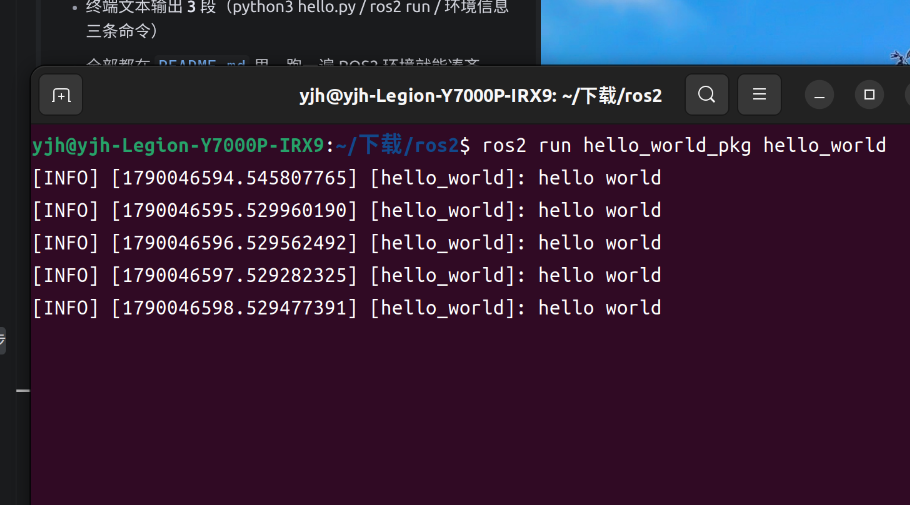
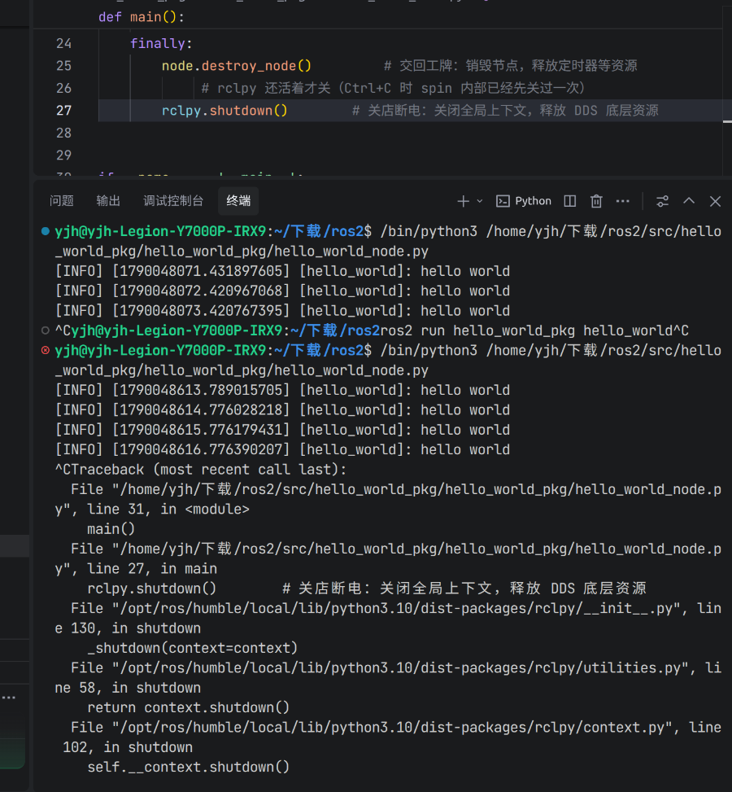
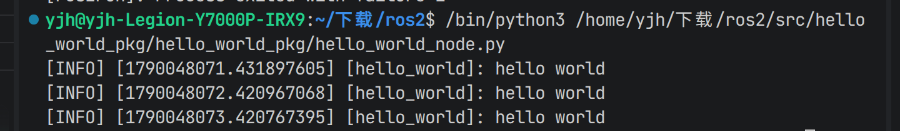
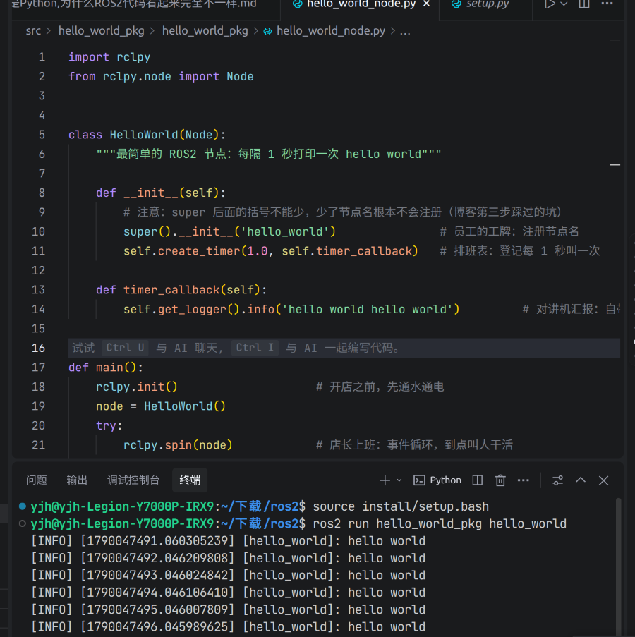

## 导言
我学过 Python，能写一些独立的程序。最早是照着 ROS1 的资料学机器人的：不用类，init_node 报个名字，Subscriber 挂上回调，spin 一转就能跑，我还用奶茶店的方式给它们记了笔记。
后来第一次看 ROS2 代码，每个词都认识，连起来却不知道在干什么：rospy 变成了 rclpy，函数变成了必须继承 Node 的类，还多出来一个 Executor。
明明都是 import，都是 class，都是 def，但写出来的东西感觉像另一门语言。
后来我发现，不是语法变了，是写代码的方式变了。Python 还是那个 Python，但 ROS2 给它套了一层新的编程模型。
为了更好地理解这份不同，这篇博客我用奶茶店的方式来思考。
## 第一步，先直观感受二者的不同
现在我们先分别写出两种每隔1秒打印`hello world`的代码。
### 普通Python代码
```python
import time

def main():
    while True:
        print('hello world')
        time.sleep(1)

if __name__ == '__main__':
    main()
```
### ROS2代码
```python
import rclpy
from rclpy.node import Node

class HelloWorld(Node):
    def __init__(self):
        super().__init__('hello_world')
        self.create_timer(1.0, self.timer_callback)

    def timer_callback(self):
        self.get_logger().info('hello world')

def main():
    rclpy.init()
    node = HelloWorld()
    rclpy.spin(node)
    rclpy.shutdown()
if __name__ == '__main__':
    main()
```
这两个同样都是python代码,但写法完全不一样。
因为普通python是一个程序的执行,就像是奶茶店的一份订单,员工只需要根据订单执行烧水、放茶包、倒奶这些操作就行.
而ROS2代码则是一个节点的执行,是一整个奶茶店,店里要有员工、工牌、对讲机、店长调度，店要开着,等等更细更广的内容。
顺便说一句：这段 ROS2 代码现在直接 Ctrl+C 退出，会蹦一串红色报错，先别慌——第六步会教你优雅地退出。


为突出主干，这里贴的是**最简版**（只有 `init` / `spin` / `shutdown` 三件套，省略了清理代码），方便你看清结构。带 `try/finally` 兜底清理的**完整版**见仓库的 `hello_world_node.py`，或直接跳到第六步。
下面我们就来分别解释一下。
## 第二步，认识"直接开始"与"先开店"的差异
### 普通Python代码
```python
if __name__ == '__main__':
    main()
```
脚本从这里开始,执行完结束。就像是员工接到一份订单，按步骤把奶茶做好，这一单就结束了。
### ROS2 Python代码
```python
rclpy.init()
node = HelloWorld()
rclpy.spin(node)
```
`rclpy.init()` 初始化 ROS2 的全局上下文，包括 DDS 通信层、节点管理、日志系统。
简单来讲就是“通电”,也就是开店之前通水通电,否则有员工也没法工作。
至于代码里的另一行 `rclpy.spin(node)`，你现在只需要混个脸熟——它是店长，第四步细讲。
## 第三步,从函数到类
### 普通Python代码
```python
def main():
    while True:
        print('hello world')
        time.sleep(1)
```
像是员工接到一份订单，按步骤把奶茶做好，这一单就结束了。
### ROS2 Python代码
必须继承`Node`类
```python
class HelloWorld(Node):
    def __init__(self):
        super().__init__('hello_world')
```
ROS2 里，节点是一个常驻对象，不是一次性函数。它要一直活着，等消息、等定时器、等服务请求。类适合承载这种“有状态、长期运行”的东西。
用奶茶店来讲,普通函数像是临时工,干完就走,而ROS2节点像是正式员工,有工牌（节点名），有岗位（发布者/订阅者），要一直在店里待着。
这里有个容易犯的错：`super().__init__('hello_world') `少一对括号，节点名字根本不会注册。我一开始就踩了这个坑。
```python
    super.__init__('hello_world') #错误写法
    super().__init__('hello_world') #正确写法
```
## 第四步,从顺序执行到回调驱动
这里是最大的差异,也是最重要的一个。
先解释一个词： **回调（callback）** ——把一个函数登记给系统，等特定事件发生时，由系统来调用它，而不是你自己去调。理解了它，后面才看得懂。
### 普通Python代码
```python
while True:
    print('hello world')
    time.sleep(1)
```
这段代码其实干了两件事：`print` 是“要重复做的事”，`while True` 加 `sleep(1)` 是“多久做一次”。两件事挤在一起，顺序执行：打印、等1秒、再打印、再等1秒，以此类推。
### ROS2 Python代码
ROS2 把这两件事**拆开**了，先看完整写法：
```python
class HelloWorld(Node):
    def __init__(self):
        super().__init__('hello_world')
        self.create_timer(1.0, self.timer_callback)   # 排班

    def timer_callback(self):                          # 员工要做的事
        self.get_logger().info('hello world')

def main():
    rclpy.init()
    node = HelloWorld()
    rclpy.spin(node)                                   # 店长上班
```
三个角色各司其职：
- `timer_callback()` 函数：“要重复做的事”，对应普通 Python 里的 `print`。
- `self.create_timer(1.0, self.timer_callback)`：“排班”——只负责登记“每 1 秒调用一次 timer_callback”，自己并不会真的去调用。
- `rclpy.spin(node)`：“店长”——到点了真正去叫员工干活的人。

`spin` 是 ROS2 的主循环，负责等待事件、调用回调函数、处理消息等。
如果节点没有事件，它会阻塞在这里，等待有事件发生。
要注意，spin 本质上也是一个循环，但它是**事件循环**，不是死循环：等待事件时会让出 CPU，收到事件才调用回调。
也千万别自己在节点里另写一个 `while True`——它会霸占线程，事件循环转不动，订阅消息收不到、定时器不触发，整个节点就“卡死”在循环里了。
### 对照一下

| 普通 Python | ROS2 | 奶茶店 |
|------------|------|--------|
| `print('hello world')`（做什么） | `timer_callback()` | 员工要做的事 |
| `while True` + `sleep(1)`（多久做一次） | `create_timer` + `spin` | 排班表 + 店长盯着 |

普通 Python 把“做什么”和“多久做一次”挤在一段 while 里；ROS2 把它们拆开：callback 负责“做什么”，timer 负责“多久一次”，spin 负责“谁来盯着执行”。

奶茶店翻译：`timer_callback` 是员工，`create_timer` 是排班表，`spin` 是店长。排班表写了“每 5 分钟巡店”，但店长不来，员工就不会动；反过来，店长来了，没有排班表，他也不知道该叫谁干活。三者缺一不可。
### 为什么要这么改：控制权换手了
前面四步讲的都是“改了什么”，但我真正想明白的是另一个问题：为什么非要改？Python 好好的 while 循环，难道不香吗？
#### 核心：谁说了算
普通 Python 里，你的代码是主角：while 循环你自己转，`print` 你自己调，`sleep` 你自己等，一切按你写的顺序来，你调用库。
ROS2 里恰好反过来：你的代码只负责登记——“每 1 秒叫我一次 timer_callback”——然后就撤了。真正的流程由 spin 掌控：它等事件、挑时机、调用你的函数。
这叫**控制反转**：不是你找活干，是活来找你。
#### 因为机器人等不了 while 循环
如果还是用 while 循环顺序轮询，会发生什么？

```python
while True:
    检查雷达()      # 正在检查雷达时，急停按下了 → 听不到！
    检查摄像头()    # 正在处理图像时，雷达数据到了 → 堆积！
    sleep(0.1)     # 睡觉的 0.1 秒里发生的一切 → 全错过！
```

顺序执行的前提是“世界按我的节奏来”。但机器人身上，雷达数据每秒 10 次、摄像头每秒 30 帧、电机指令、急停按钮……这些事件随时来、无序来、预测不了，不按你的节奏走。
所以只能换思路：**我不猜事件什么时候来，我把处理函数提前登记好，事件来了系统自动叫我**。这就是回调 + spin 存在的理由。
何况机器人系统往往还是**分布式**的：多个节点跑在不同机器上互相配合，谁也不能抱着一个 while 循环独自转。所以 ROS2 选择了「声明 + 事件循环」的模型——你声明要做什么，事件循环决定什么时候做。这牺牲了一点直观，换来的是可控和可靠。
#### 奶茶店比喻的续写
普通 Python 像**摆地摊**：你一个人，按自己的顺序干活，干完一轮眯 1 秒，眯的时候客人来了也听不见。
ROS2 像**开进商场**：商场客流不断，你给每个岗位配好员工（callback）、挂上排班表（timer），店长（spin）盯着柜台——单子什么时候来不确定，但**单子一来就有人接**，多张单子也能被有序分发，不会因为你打盹而丢单。
#### 其实你早就写过这种代码
网页里写 `button.onclick = 函数` 时，你从来不会写 `while True: 检查按钮有没有被点`——你只登记函数，等浏览器来调。游戏引擎的按键处理、小程序的事件响应，全是同一个模型。
**ROS2 只是把这个模型用在了机器人通信上**，所以代码才长成我们第一眼看不懂的样子。
回头看导言里的困惑：不是语法变了，是控制权换了手。看懂这一点，ROS2 代码里那些“绕”的写法，突然就都顺了。
## 第五步 从`print`到`logger`
### 普通Python代码
```python
print("hello")
```
输出到终端，完事。
### ROS2 Python代码
```python
self.get_logger().info('hello')
```
这不是把 print 换了个名字，而是换成了日志系统。它比 print 多了几样东西：
- **日志级别**：DEBUG / INFO / WARN / ERROR / FATAL，可以按重要性过滤；
- **时间戳和节点名**：每条日志自带“谁、在什么时候说的”；
- **统一采集**：能被 `rqt_console` 这类工具集中查看；
- **输出到文件**：可以配置落盘，方便事后排查。

下面是 `ros2 run hello_world_pkg hello_world` 的真实运行截图，你可以亲眼看到时间戳、节点名和日志级别：



奶茶店翻译：print 像员工自己嘟囔一句，说完就散了。`get_logger().info()` 像用对讲机汇报——有频道、有记录，店长能统一监听。还记得第一步里提到的“对讲机”吗？就是它。
## 第六步 从脚本结束到交回工牌
### 普通Python代码
脚本跑完，自动退出，没什么需要清理的。
### ROS2 Python代码
```python
node.destroy_node()
rclpy.shutdown()
```
`destroy_node()` 负责销毁节点，释放它名下的发布者、订阅者、定时器等资源。
`rclpy.shutdown()` 负责关闭 rclpy 的全局上下文，释放 DDS 底层资源。

不清理会怎样？同一进程里反复创建节点又不销毁，会积累垃圾资源；虽然进程退出后操作系统会兜底回收，但清理是应该养成的习惯。

标准写法是用 try/finally 兜底，保证 Ctrl+C 退出时也能清理干净：

```python
try:
    rclpy.spin(node)
except KeyboardInterrupt:
    pass
finally:
    node.destroy_node()
    if rclpy.ok():        # rclpy 还活着才关（Ctrl+C 时 spin 内部已经先关过一次）
        rclpy.shutdown()
```

Ctrl+C 会触发 `KeyboardInterrupt`，所以无论正常跑完还是被中断，finally 里的清理代码都会执行。
奶茶店翻译：`destroy_node()` 是员工交回工牌，`rclpy.shutdown()` 是关店断水断电。
不交工牌、不关店，虽然下班后商场会自动断水断电（操作系统兜底回收），但该自己交的工牌没交、该关的设备没关，第二天开门就是一堆乱糟糟的收尾活——养成主动清理的习惯，才不会留尾巴。

> **补一个我自己踩的坑**：上面的写法里 `rclpy.shutdown()` 不能裸调——Ctrl+C 时 `spin` 内部的 SIGINT 处理器已经先调过一次 `rclpy.shutdown()`，finally 里再调就会报 `rcl_shutdown already called`。修复就是关之前先瞅一眼店还开着没，`rclpy.ok()` 就是在干这个。
>
> 下面两张图是我自己跑出来的对比：
>
> 有 try/finally 但没 `if rclpy.ok():`，Ctrl+C 还是会报错：
> 
>
> 加上 `if rclpy.ok():` 之后，Ctrl+C 干净退出：
> 
>
> 奶茶店翻译：下班锁门之前先确认门是不是已经锁了，别咔咔拧两下把锁拧坏。


## 第七步 从`python xxx.py`到`ros2 run`
### 普通Python代码
```bash
python my_script.py
```
直接读源码运行，改完保存再跑就是新的。
### ROS2 Python代码
```bash
ros2 run hello_world_pkg hello_world
```
`ros2 run` 不是从源码目录启动，而是从 install 目录启动编译安装好的节点。所以有个新手必踩的坑：**改完代码必须重新 `colcon build`，再 `source install/setup.bash`，否则跑起来的还是旧版本**——代码明明改了，行为却没变，很多人在这里怀疑人生。

我自己踩这个坑时的真实截图，把打印内容改成 `hello ROS2` 但没 build，直接跑还是旧的 `hello world`：



从零建包（package.xml、setup.py 这些文件哪来的）和构建的完整步骤，见文末 GitHub 仓库的 README。

奶茶店翻译：`python xxx.py` 像你在厨房里试做新品，直接尝，做出来是什么就是什么。`ros2 run` 像顾客照着门店菜单点单，只认正式印刷的版本。你改了研发菜单但没重新印刷（build），顾客点到的还是旧菜单。
## 对学习者的启示
我踩过的弯路是：用 Python 脚本的思维去读 ROS2 代码，越读越糊涂。后来我给自己定了一套“先问”清单：
- 看到 `create_*`，先问：谁来驱动它？
- 看到回调，先问：它在哪个线程执行？
- 看到类，先问：它继承了什么？
- 改完代码，先问：build 了吗？source 了吗？
- 看到 `while True`，先问：会不会阻塞事件循环？

ROS2 不是 Python 的扩展，是另一种写程序的方式。理解这一点，比记住任何 API 都重要。
## 结尾
这篇博客只覆盖了我目前学到的部分,后续会继续记录。

奶茶店类比已经帮我看懂了节点、回调、日志这些概念，我相信它也能延伸到发布订阅、Executor——等我学懂了写了再补链接进来。但它帮不了我理解 DDS 底层通信、QoS 协商、生命周期状态机——那些是另一层的东西，需要另外的类比，或者直接读文档。

如果文中有理解错误的地方，欢迎指出。

环境信息：
- Ubuntu 22.04
- ROS2 Humble
- Python 3.10

完整代码：[wbxxmz/ros2-hello-world](https://github.com/wbxxmz/ros2-hello-world)
## 附：差异速查表

| 维度 | 普通 Python | ROS2 Python | 奶茶店翻译 |
|------|------------|-------------|-----------|
| 入口 | `if __name__ == '__main__'` | `rclpy.init()` + `spin()` | 自己冲一杯 vs 开店 |
| 组织 | 函数 | 类继承 `Node` | 临时工 vs 正式员工 |
| 执行 | 顺序执行 | 回调驱动 | 自己动手 vs 店长调度 |
| 循环 | `while True` | `spin()` 事件循环 | 自己盯着转 vs 店长统一调度 |
| 输出 | `print()` | `get_logger().info()` | 自己嘟囔 vs 对讲机汇报 |
| 退出 | 脚本结束 | `destroy_node()` + `shutdown()` | 直接走 vs 交工牌关店 |
| 运行 | `python xxx.py` | `ros2 run 包名 节点名` | 厨房试做 vs 门店菜单 |